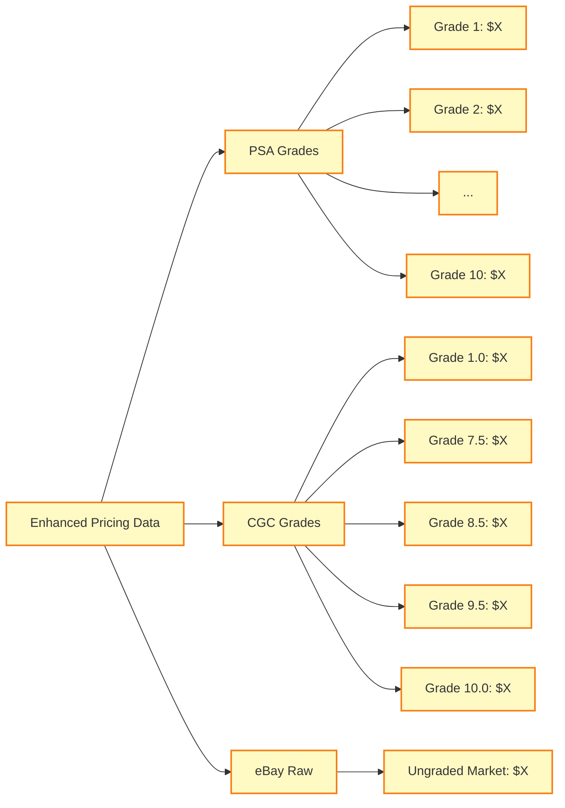
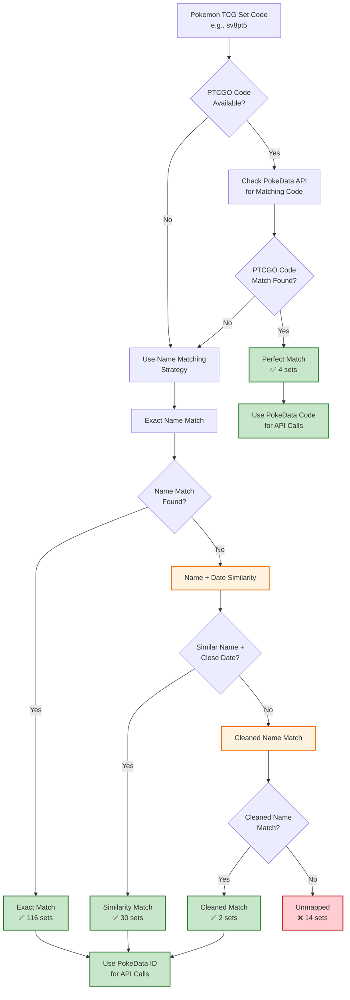

# Enhanced Pricing Data Collection Flow

## Complete Request Flow Diagram

```mermaid
flowchart TD
    %% Client Request
    A["Client Request<br/>/api/GetCardInfo/cardId"] --> B["Parse Query Parameters<br/>forceRefresh, TTL"]
    
    %% Cache Check
    B --> C{"Redis Cache<br/>Enabled?"}
    C -->|"Yes & !forceRefresh"| D["Check Redis Cache<br/>Key: card:cardId"]
    C -->|"No or forceRefresh"| E["Skip to Database"]
    
    D --> F{"Cache Hit?"}
    F -->|Yes| G["Return Cached Card<br/>+ Cache Age"]
    F -->|No| E
    
    %% Database Check
    E --> H["Query Cosmos DB<br/>SELECT * FROM c WHERE c.id = cardId"]
    H --> I{"Card Found<br/>in Database?"}
    I -->|Yes| J["Load Card from DB<br/>card.pokeDataId may exist"]
    I -->|No| K["Fetch from Pokemon TCG API<br/>GET /v2/cards/cardId"]
    
    %% External API
    K --> L{"Pokemon TCG<br/>API Success?"}
    L -->|Yes| M["Save New Card to Cosmos DB<br/>card.pokeDataId = null initially"]
    L -->|No| N["Return 404 Error"]
    
    %% Universal Enrichment Entry Point
    G --> O["Universal Enrichment<br/>Evaluation"]
    J --> O
    M --> O
    
    %% Enrichment Conditions
    O --> P{"Condition 1:<br/>card.tcgPlayerPrice<br/>is null?"}
    P -->|"Yes & !cached"| Q["Fetch TCG Player Pricing<br/>pokemonTcgApiService.getCardPricing(cardId)"]
    P -->|"No or cached"| R{"Condition 2:<br/>card.enhancedPricing<br/>is null?"}
    
    Q --> Q1{"TCG Pricing<br/>Retrieved?"}
    Q1 -->|Yes| Q2["Add TCG Pricing<br/>card.tcgPlayerPrice = pricing"]
    Q1 -->|No| Q3["Log: TCG Pricing<br/>Unavailable"]
    Q2 --> R
    Q3 --> R
    
    %% Enhanced Pricing Flow
    R -->|Yes| S["Enhanced Pricing<br/>Collection Flow"]
    R -->|No| T{"Condition 3:<br/>card.pokeDataId<br/>is null?"}
    
    %% Enhanced Pricing Details - More Specific
    S --> S1{"card.pokeDataId<br/>exists?"}
    S1 -->|"Yes (from DB)"| S2["Use Existing PokeData ID<br/>pokeDataId = card.pokeDataId"]
    S1 -->|"No (null)"| S3["Extract from cardId<br/>using regex: /(.*)-(\d+.*)/"]
    
    S2 --> S4["Call PokeData API<br/>GET /v0/pricing?id=pokeDataId&asset_type=CARD"]
    
    S3 --> S5["Parse cardId Result:<br/>setCode = match[1] (e.g., 'sv8pt5')<br/>cardNumber = match[2] (e.g., '161')"]
    S5 --> S6{"setCode<br/>extracted?"}
    S6 -->|Yes| S7["Query Set Mapping Service<br/>setMappingService.getPokeDataSetCode(setCode)"]
    S6 -->|No| S8["Fallback: Legacy Method<br/>Use cardNumber only"]
    
    S7 --> S9{"Mapping Found<br/>in set-mapping.json?"}
    S9 -->|"Yes (91.6% coverage)"| S10["Get Mapped PokeData Set Code<br/>pokeDataSetCode = mapping.pokeDataCode"]
    S9 -->|"No (8.4% unmapped)"| S11["Query PokeData API for Set<br/>GET /v0/sets → find by setCode"]
    
    S10 --> S12["Find Card in PokeData<br/>GET /v0/set?set_id=setId<br/>→ find card where num = cardNumber"]
    S11 --> S12
    S12 --> S13{"PokeData Card<br/>Found?"}
    S13 -->|"Yes"| S14["Extract PokeData ID<br/>pokeDataId = card.id<br/>Call GET /v0/pricing?id=pokeDataId"]
    S13 -->|No| S8
    
    S8 --> S15["Legacy API Call<br/>GET /v0/pricing?id=cardNumber&asset_type=CARD<br/>(may return wrong card)"]
    
    S4 --> S16{"Pricing Data<br/>Retrieved?"}
    S14 --> S16
    S15 --> S16
    
    S16 -->|Yes| S17["Map PokeData Response<br/>to Enhanced Format"]
    S16 -->|No| S18["Log: Enhanced Pricing<br/>Unavailable"]
    
    S17 --> S19["Process PSA Grades<br/>Extract 'PSA 1.0' through 'PSA 10.0'<br/>→ psaGrades['1'] to psaGrades['10']"]
    S19 --> S20["Process CGC Grades<br/>Extract 'CGC 1.0' through 'CGC 10.0'<br/>Including half grades (7.5, 8.5, 9.5)<br/>→ cgcGrades['8_5'] format"]
    S20 --> S21["Process eBay Raw<br/>Extract 'eBay Raw' pricing<br/>→ ebayRaw.value"]
    S21 --> S22["Add Enhanced Pricing<br/>card.enhancedPricing = {psaGrades, cgcGrades, ebayRaw}"]
    
    S18 --> T
    S22 --> T
    
    %% PokeData ID Mapping - More Detailed
    T -->|"Yes"| U["Attempt PokeData ID Mapping<br/>(for future pricing calls)"]
    T -->|"No"| V{"Card Object<br/>Modified?"}
    
    U --> U1["Extract Identifiers<br/>const {setCode, number} = extractCardIdentifiers(cardId)"]
    U1 --> U2["Check Set Mapping<br/>setCode = setMappingService.getPokeDataSetCode(setCode)"]
    U2 --> U3{"Set Mapping<br/>Found?"}
    U3 -->|"Yes"| U4["Get PokeData Card ID<br/>pokeDataApiService.getCardIdBySetCodeAndNumber(setCode, number)"]
    U3 -->|"No"| U5["Log: Set Mapping Failed<br/>card.pokeDataId remains null"]
    
    U4 --> U6["Store PokeData ID<br/>card.pokeDataId = foundId<br/>(for future enrichment)"]
    U5 --> V
    U6 --> V
    
    %% Save Changes
    V -->|"Yes"| W["Save Updated Card<br/>cosmosDbService.saveCard(card)"]
    V -->|"No"| X["Skip Database Save"]
    
    W --> Y["Update Redis Cache<br/>redisCacheService.set(cacheKey, card, ttl)"]
    Y --> Z["Process Image URLs<br/>processImageUrls(card, imageOptions)"]
    X --> Z
    
    %% Final Response
    Z --> AA["Build API Response<br/>{status: 200, data: card, cached: boolean}"]
    AA --> BB["Add Cache Headers<br/>Cache-Control: public, max-age=ttl"]
    BB --> CC["Return JSON Response<br/>to Client"]
    
    %% Error Path
    N --> DD["Build Error Response<br/>{status: 404, error: 'Card not found'}"]
    DD --> CC
    
    %% Dark Mode Friendly Styling
    classDef cacheStyle fill:#1e3a8a,stroke:#3b82f6,stroke-width:2px,color:#ffffff
    classDef dbStyle fill:#581c87,stroke:#8b5cf6,stroke-width:2px,color:#ffffff
    classDef apiStyle fill:#ea580c,stroke:#f97316,stroke-width:2px,color:#ffffff
    classDef enrichStyle fill:#166534,stroke:#22c55e,stroke-width:2px,color:#ffffff
    classDef errorStyle fill:#dc2626,stroke:#ef4444,stroke-width:2px,color:#ffffff
    classDef processStyle fill:#a16207,stroke:#eab308,stroke-width:2px,color:#ffffff
    classDef mappingStyle fill:#7c2d12,stroke:#f97316,stroke-width:2px,color:#ffffff
    
    class D,F,G,Y cacheStyle
    class H,I,J,M,W dbStyle
    class K,L,Q,S4,S14,S15 apiStyle
    class O,P,R,S,S17,S19,S20,S21,S22 enrichStyle
    class N,DD errorStyle
    class B,Z,AA,BB processStyle
    class S5,S7,S9,S10,S12,U1,U2,U4 mappingStyle
```

## Enhanced Pricing Data Structure

## Set Mapping Strategy Flow

## Performance Metrics & Timing

The system tracks detailed timing for each operation:

- **Cache Operations**: Redis read/write times
- **Database Operations**: Cosmos DB query/save times  
- **API Calls**: Pokemon TCG API and PokeData API response times
- **Enrichment**: Individual enrichment condition timing
- **Total Request**: End-to-end request processing time

## Key Features

1. **Multi-Tiered Caching**: Redis → Cosmos DB → External APIs
2. **Conditional Enrichment**: Only fetch missing data
3. **Intelligent Set Mapping**: 91.6% coverage with fallback strategies
4. **Comprehensive Pricing**: PSA, CGC, and eBay market data
5. **Error Resilience**: Graceful fallbacks at each level
6. **Performance Monitoring**: Detailed timing and correlation IDs
